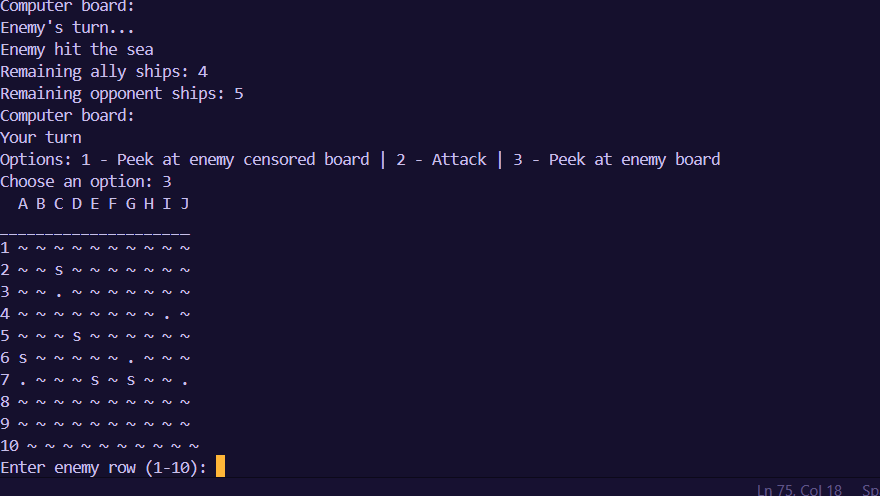
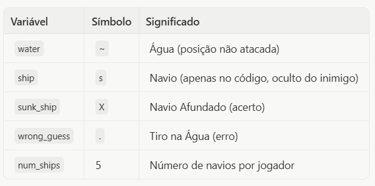
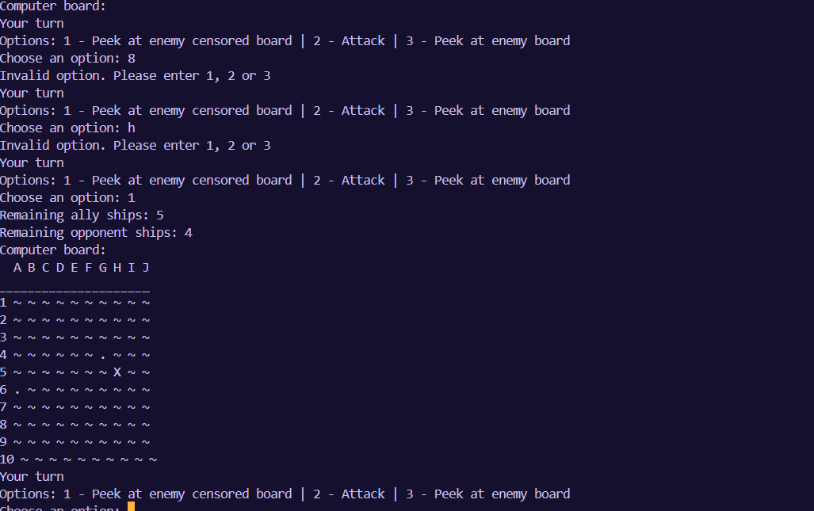
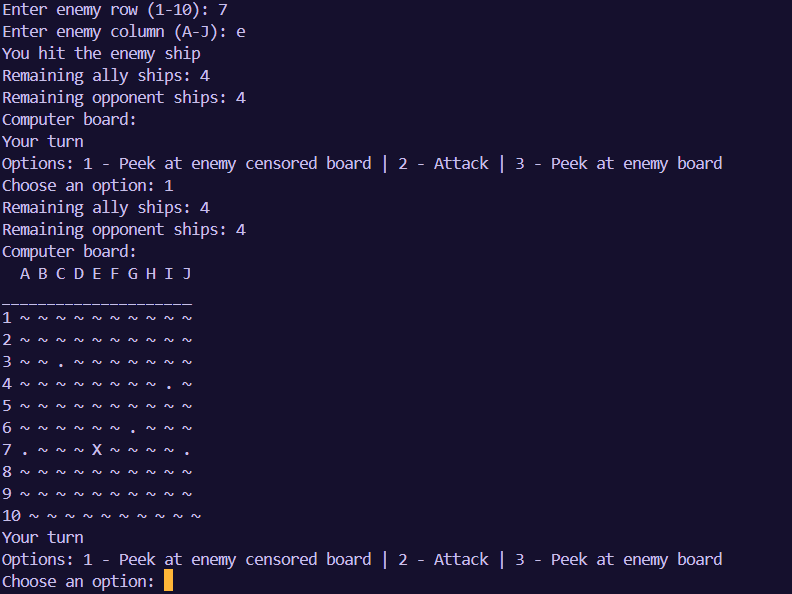
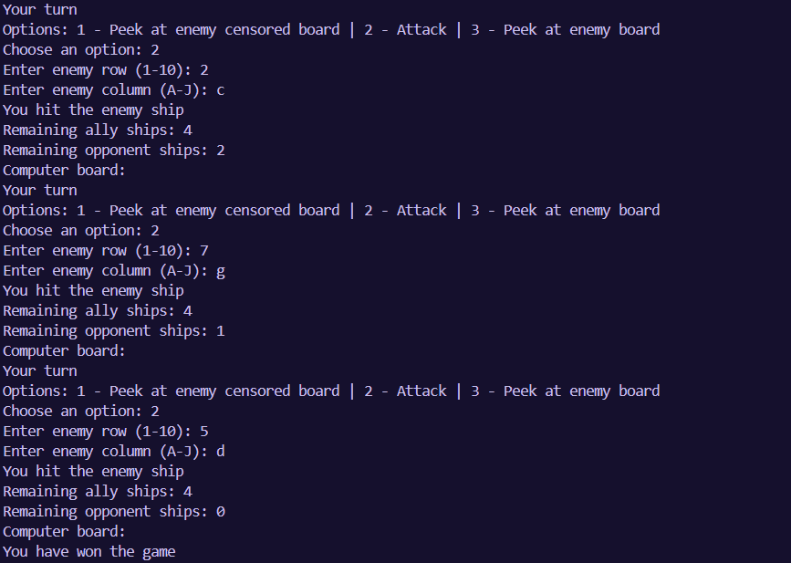
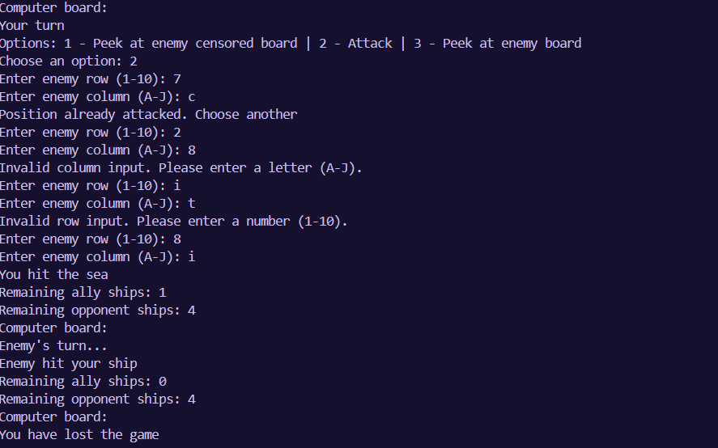

    Batalha Naval 

🎯 Objetivo do Trabalho

Este projeto consiste na implementação do clássico jogo de Batalha Naval em Python, rodando diretamente no terminal. O objetivo principal do trabalho foi aplicar os conceitos de programação estruturada, manipulação de listas (representando o tabuleiro) e lógica de controle de fluxo (`while`, `if/else`) para criar uma experiência de jogo completa entre o usuário e o computador.

⚙️ Como Iniciar/Terminar a Execução

1.  Pré-requisito: Certifique-se de ter o Python instalado na sua máquina (versão 3.x).
2.  Execução: Abra o terminal (ou Prompt de Comando) na pasta onde o arquivo `batalha_naval.py` (ou o nome que você deu ao arquivo do código) está salvo e execute o comando:

    ```bash
    python3 batalha_naval.py
    ```

O jogo começará imediatamente, pedindo para você posicionar seus 5 navios.



3.  Terminar: O jogo termina automaticamente quando você ou o computador afundarem todos os 5 navios do oponente.

💻 Estrutura do Código: Entendendo as Funções

Nosso código foi dividido em algumas funções principais para deixar tudo mais organizado e fácil de entender. A lógica do jogo se concentra em manipular duas matrizes 10x10, uma para o jogador e outra para o computador, preenchidas inicialmente com `~` (água).

 1. Constantes e Variáveis Iniciais

No começo, definimos as variáveis que representam os símbolos no tabuleiro e o número de navios:



 2. Funções de Visualização do Tabuleiro

Temos duas funções para mostrar o tabuleiro, dependendo de quem está olhando:

-   `print_player_board(board)`:
    Essa função é usada para mostrar o seu tabuleiro. Ela é bem direta, mostrando a posição exata dos seus navios (`s`), dos seus navios afundados (`X`) e onde o computador atirou na água (`.`). É importante para você saber onde seus navios estão e onde você foi atingido.

-   `shows_computer_board(board)`: Essa função é a que revela o tabuleiro completo do computador, incluindo a posição dos navios (s). Ela é chamada quando o jogador escolhe a opção "código secreto" (opção 3) durante o jogo, sendo útil para fins de teste ou para ver o resultado final.


-   `shows_hidden_computer_board(board)`:
    Essa é a função que mostra o tabuleiro do inimigo durante o jogo. Ela é "censurada", ou seja, só mostra o que você já atacou (`X` ou `.`) e o resto como água (`~`). As posições reais dos navios do computador (`s`) ficam escondidas para manter a graça do jogo!



 3. Funções de Montagem do Tabuleiro

-   `position_ships(board)`:
    Essa função é a responsável por permitir que o jogador posicione seus 5 navios. Ela entra em um laço de repetição que roda 5 vezes. A cada rodada, ela pede a linha (1-10) e a coluna (A-J) e verifica se a posição é válida (se está dentro do tabuleiro e se já não tem um navio ali). Depois de tudo certo, ela coloca o símbolo do navio (`s`) na matriz.

-   `build_computer_board(board)`:
    Essa função faz a mesma coisa que a anterior, mas para o computador. Para garantir a aleatoriedade e o desafio, ela usa a função `random.randint` para escolher 5 posições aleatórias no tabuleiro e coloca os navios do inimigo.

 4. Funções de Controle e Lógica

-   `count_sunk_ships(board)`:
    Uma função auxiliar muito útil! Ela simplesmente conta quantos navios afundados (`X`) existem em um tabuleiro. Isso é crucial para sabermos quantos navios restam para cada jogador.

-   `show_info(player_board, computer_board)`:
    Essa função é chamada a cada rodada para mostrar as informações mais importantes: quantos navios restam para você e para o computador.

-   `battleship(player_board, computer_board)`:
    
    1.  Primeiro, ela chama as funções de montagem de tabuleiro para o jogador e o computador.
    2.  Em seguida, entra no `while True` principal, que só para quando a vida (o número de navios restantes) de um dos jogadores chega a zero.
    3.  Dentro do loop, ela gerencia a vez do jogador e a vez do computador.

🕹️ Opções Oferecidas e Fluxo de Jogo

Quando é a sua vez, o programa te dá 3 opções:

1.  Espiar o tabuleiro inimigo censurado (Padrão): Mostra as informações de vidas e o tabuleiro do inimigo, mas sem revelar os navios.
2.  Atacar: Permite que você insira as coordenadas (linha e coluna) do seu ataque.
3.  Espiar o tabuleiro inimigo (Revelado): Essa é a opção "código secreto"! Se você digitar 3, o tabuleiro do inimigo é revelado, mostrando a posição real de todos os navios (`s`). 

 O Ataque

Ao escolher a opção 2, o programa verifica se as coordenadas que você digitou são válidas e se você já não atacou aquele local.

-   Acerto: Se houver um navio (`s`) na posição, ele muda o símbolo para `X` e você ganha outra jogada (`player_turn` continua `True`).
-   Erro: Se for água, ele muda para `.` e a vez passa para o computador (`player_turn` se torna `False`).



Na vez do computador, a lógica é parecida, mas as coordenadas de ataque são escolhidas aleatoriamente (`randint`). Ele também verifica se a posição já foi atacada.

-   Se o computador acerta seu navio, ele marca com `X`.
-   Se erra, marca com `.` e a vez volta para você.

🖥️ Principais Telas

As principais telas são a de Posicionamento de Navios e a de Jogo.

1.  Tela de Posicionamento: É onde você interage para colocar seus 5 navios, vendo seu tabuleiro sendo montado a cada navio colocado.

2.  Tela de Jogo: É a tela principal onde você vê o status das vidas, o seu tabuleiro e o tabuleiro censurado do inimigo, e escolhe a ação (espiar ou atacar).




📝 Conclusão

O projeto de Batalha Naval foi um excelente exercício para consolidar o aprendizado em listas aninhadas (matrizes) e programação modular com funções. A parte mais desafiadora foi garantir que a lógica de turno, as verificações de coordenadas e a aleatoriedade do computador funcionassem perfeitamente.

Possíveis Melhorias Futuras:

-   Implementar navios de tamanhos diferentes (2, 3, 4 e 5 posições) em vez de apenas 5 navios de 1 posição.
-   Criar uma interface gráfica (GUI) usando bibliotecas como `Tkinter` ou `Pygame` para uma experiência visual melhor.
-   Adicionar um modo de jogo contra outro jogador (multiplayer local).

🎓 Créditos

Aluna: Maria Eduarda Alves Barbosa - 4° período
Professor: Guido Pantuza 
Disciplina: Progamaçâo em Python
